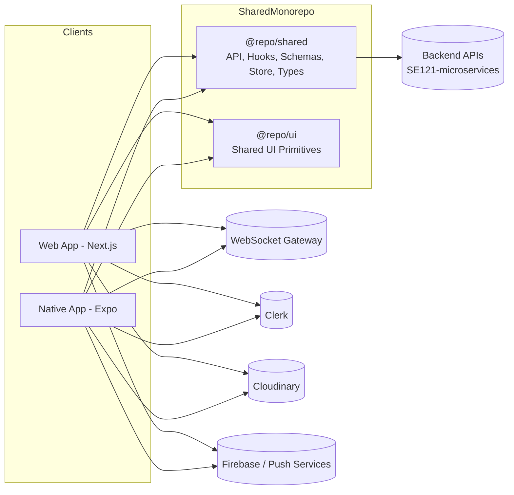
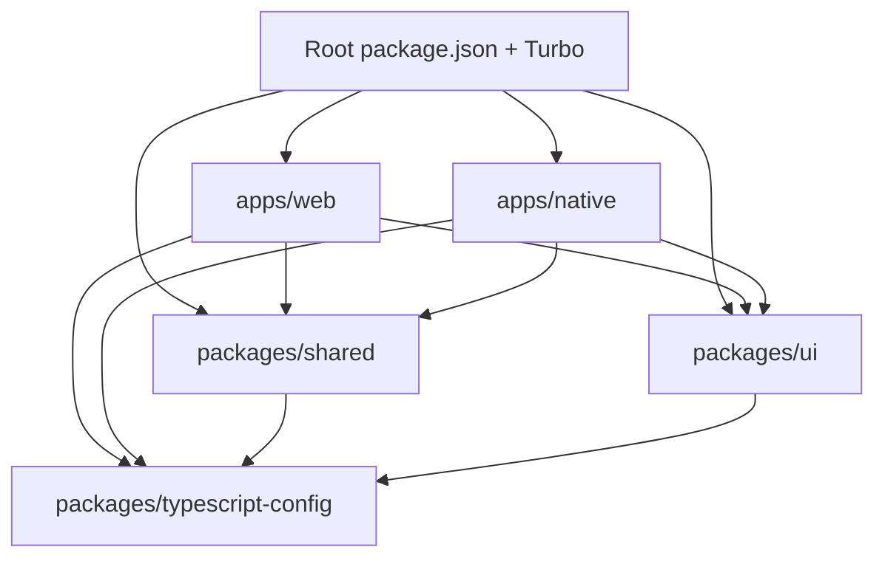
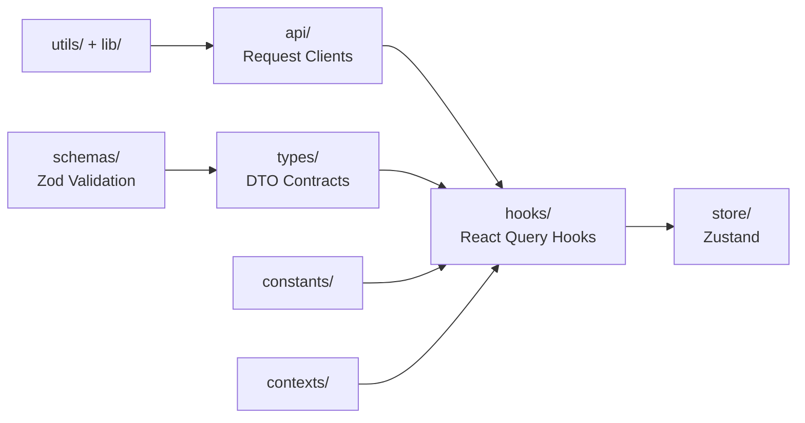

# 🌟 Sentimeta - Mạng xã hội đa nền tảng tích hợp phân tích cảm xúc (Monorepo)

👉 **Backend Repository:** [SE121-microservices](https://github.com/LeVanHuy84/SE121-microservices)

Sentimeta là một hệ sinh thái mạng xã hội đa nền tảng hiện đại, tích hợp sâu các công nghệ Trí tuệ nhân tạo (AI) như phân tích cảm xúc (Emotion Intelligence), Chatbot, và hệ thống gợi ý (Recommendation). Dự án được thiết kế theo kiến trúc Microservices ở Backend và Monorepo ở Frontend, đảm bảo khả năng mở rộng, hiệu năng cao và chia sẻ logic mượt mà.

---

## 📸 Màn hình / UI Showcase

Dưới đây là một số giao diện nổi bật của ứng dụng trên cả nền tảng Web và Mobile.

| Newsfeed (Web & App) | Realtime Chat & AI Chatbot | Profile & Phân tích cảm xúc |
| :---: | :---: | :---: |
| `` | `` | `` |
| Bảng tin cá nhân hóa với thuật toán gợi ý (Recommendation AI). | Chat thời gian thực với bạn bè và tương tác với Trợ lý ảo AI. | Trang cá nhân tích hợp báo cáo phân tích cảm xúc (Emotion AI). |

---

## ✨ Tính năng Nổi bật (Key Features)

- **🤖 AI-Powered Features:**
  - **Emotion Intelligence:** Tự động phân tích cảm xúc người dùng qua nội dung đăng tải và lịch sử hoạt động.
  - **Smart Chatbot:** Trợ lý ảo thông minh tích hợp ngay trong hệ thống chat.
  - **Recommendation Engine:** Gợi ý nội dung, bạn bè và nhóm dựa trên sở thích và hành vi.
- **📱 Đa Nền Tảng (Cross-platform):** 
  - **Web App:** Xây dựng với Next.js 15 (App Router), React 19, Tailwind CSS v4.
  - **Native App:** Ứng dụng di động mượt mà với Expo SDK 55, React Native, Uniwind (Tailwind cho RN) và HeroUI Native.
- **⚡ Realtime & Social:**
  - Nhắn tin theo thời gian thực (Realtime Chat).
  - Quản lý Cộng đồng (Groups), Bạn bè, Notifications.
- **🏗 Kiến trúc Monorepo:** Tái sử dụng tối đa logic (API Clients, Zod schemas, Zustand stores, React Query hooks) thông qua package `@repo/shared`.

---

## 🏗 Kiến trúc Hệ thống (Architecture)

### 1. High-level System



### 2. Monorepo Dependency Graph

Dự án Frontend được quản lý bởi Turborepo, cho phép cache build và tối ưu hóa workflow.



### 3. Shared Domain Layer (`@repo/shared`)

Nguyên tắc phát triển:
1. DTO/schema được định nghĩa trong `shared` trước.
2. Web và Native import cùng contract (hooks, API clients) để đảm bảo đồng nhất (tránh drift).



---

## 🛠 Tech Stack

| Layer | Công nghệ (Tech Stack) |
|---|---|
| **Monorepo** | npm workspaces, Turborepo |
| **Web** | Next.js 15, React 19, Tailwind CSS v4, Clerk, React Query |
| **Native** | Expo SDK 55, React Native 0.83, Expo Router, Uniwind, HeroUI Native, Clerk |
| **Shared** | TypeScript, Axios, Zod, Zustand |
| **Tooling** | ESLint, Prettier, GitHub Actions |

---

## 🚀 Hướng dẫn Cài đặt & Khởi chạy (Quick Start)

### Yêu cầu môi trường (Prerequisites)
- Node.js >= 18 (khuyến nghị Node 20)
- npm >= 10
- Git
- Docker & Docker Compose (cho Backend)
- **Native development:** Expo Go / Expo Dev Client, Android Studio (cho Android) hoặc Xcode (cho iOS trên macOS).

### Bước 1: Khởi chạy Backend (Microservices)

Sentimeta Frontend giao tiếp trực tiếp với hệ thống Backend Microservices (`SE121-microservices`). Bạn cần chạy Backend trước:

```bash
# Clone repo backend (đặt ngang hàng với thư mục frontend)
git clone https://github.com/LeVanHuy84/SE121-microservices SE121-microservices
cd SE121-microservices

# Cài đặt dependencies
npm install

# Khởi chạy hạ tầng local (Kafka, Redis, Postgres, MongoDB...)
docker-compose up -d

# Khởi chạy tất cả các microservices
npm run start:dev
```

*Lưu ý: Để xem chi tiết các port và biến môi trường của Backend, vui lòng tham khảo file `README.md` bên trong repo `SE121-microservices`.*

### Bước 2: Khởi chạy Frontend (Monorepo)

```bash
# Quay lại thư mục dự án frontend
cd ../social-network-2.0

# Cài đặt dependencies
npm ci

# Setup biến môi trường
cp apps/web/.env.example apps/web/.env
cp apps/native/.env.example apps/native/.env
```

*Tiến hành điền các key của Clerk, Firebase, Cloudinary... vào các file `.env` vừa tạo.*

```bash
# Khởi chạy toàn bộ (cả Web & Native)
npm run dev

# Hoặc khởi chạy từng workspace độc lập:
npm run dev --workspace web
npm run dev --workspace sentimeta-native
```

**Lệnh riêng cho Native Platform:**
```bash
npm run android --workspace sentimeta-native
npm run ios --workspace sentimeta-native
```

---

## 🔐 Environment Variables

### 1. Web (`apps/web/.env`)

| Nhóm | Biến môi trường |
|---|---|
| **Clerk Auth** | `NEXT_PUBLIC_CLERK_PUBLISHABLE_KEY`, `CLERK_SECRET_KEY`, `CLERK_WEBHOOK_SIGNING_SECRET` |
| **Clerk Routes** | `NEXT_PUBLIC_CLERK_SIGN_IN_URL`, `NEXT_PUBLIC_CLERK_SIGN_UP_URL`, `NEXT_PUBLIC_CLERK_SIGN_IN_FALLBACK_REDIRECT_URL`, `NEXT_PUBLIC_CLERK_SIGN_UP_FALLBACK_REDIRECT_URL` |
| **Backend & WS** | `NEXT_PUBLIC_BACKEND_API_URL`, `NEXT_PUBLIC_WS_URL` |
| **Cloudinary** | `NEXT_PUBLIC_CLOUDINARY_CLOUD_NAME`, `NEXT_PUBLIC_CLOUDINARY_UPLOAD_PRESET` |
| **Firebase Push** | `NEXT_PUBLIC_FIREBASE_API_KEY`, `NEXT_PUBLIC_FIREBASE_AUTH_DOMAIN`, `NEXT_PUBLIC_FIREBASE_PROJECT_ID`, `NEXT_PUBLIC_FIREBASE_STORAGE_BUCKET`, `NEXT_PUBLIC_FIREBASE_MESSAGING_SENDER_ID`, `NEXT_PUBLIC_FIREBASE_APP_ID`, `NEXT_PUBLIC_FIREBASE_VAPID_KEY` |

### 2. Native (`apps/native/.env`)

| Nhóm | Biến môi trường |
|---|---|
| **Clerk Auth** | `EXPO_PUBLIC_CLERK_PUBLISHABLE_KEY` |
| **Backend & WS** | `EXPO_PUBLIC_API_URL`, `EXPO_PUBLIC_WS_URL` |
| **Cloudinary** | `EXPO_PUBLIC_CLOUDINARY_CLOUD_NAME`, `EXPO_PUBLIC_CLOUDINARY_UPLOAD_PRESET` |

---

## 📜 Các Scripts Hữu Ích

Thực thi tại root directory (`social-network-2.0/`):

| Lệnh | Chức năng |
|---|---|
| `npm run dev` | Chạy dev mode bằng Turbo |
| `npm run lint` | Lint code cho tất cả workspace |
| `npm run typecheck` | Kiểm tra TypeScript toàn dự án |
| `npm run build` | Build dự án theo dependency graph của Turbo |
| `npm run ci` | Chạy lint + typecheck + build |
| `npm run format` | Chạy Prettier format code |

*(Lưu ý: Các lệnh `se121:*` dùng để call script sang thư mục Backend `../SE121-microservices`)*

---


## 📄 Tài liệu Công nghệ (Official Documentation)

- **Next.js (Web Framework):** [https://nextjs.org/docs](https://nextjs.org/docs)
- **Expo (Mobile Framework):** [https://docs.expo.dev](https://docs.expo.dev)
- **Clerk (Authentication):** [https://clerk.com/docs](https://clerk.com/docs)
- **Turborepo (Monorepo Build System):** [https://turbo.build/repo/docs](https://turbo.build/repo/docs)
- **Tailwind CSS v4:** [https://tailwindcss.com/docs](https://tailwindcss.com/docs)
- **React Query (Data Fetching):** [https://tanstack.com/query](https://tanstack.com/query)
- **Zustand (State Management):** [https://docs.pmnd.rs/zustand](https://docs.pmnd.rs/zustand)
- **Zod (Schema Validation):** [https://zod.dev](https://zod.dev)
- **HeroUI Native (Mobile UI):** [https://heroui.com](https://heroui.com)
