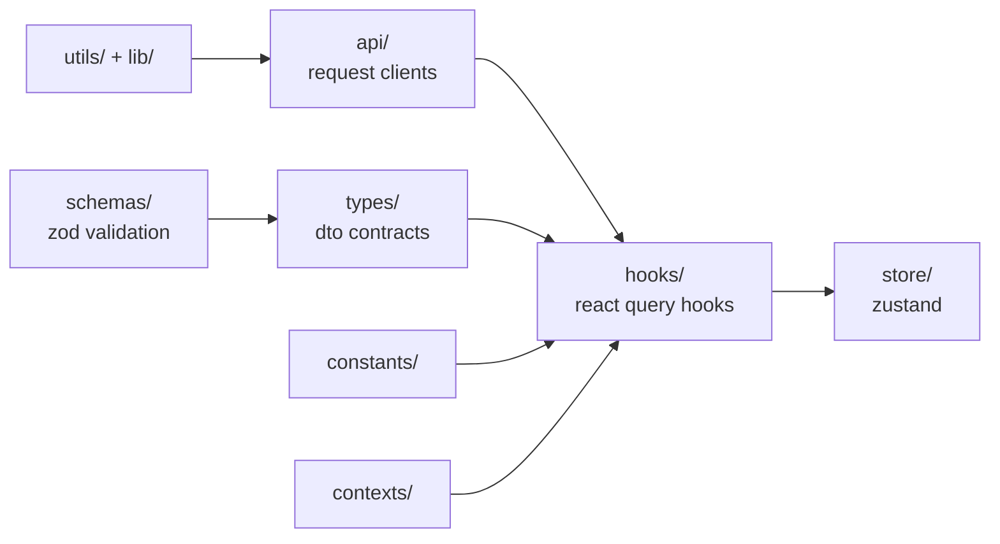
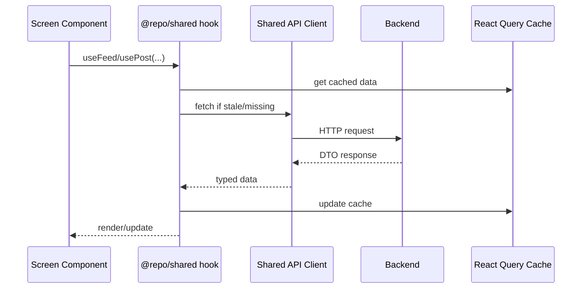
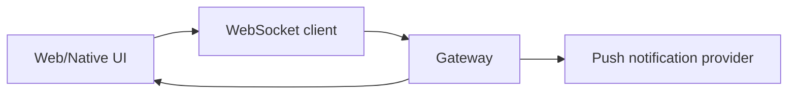
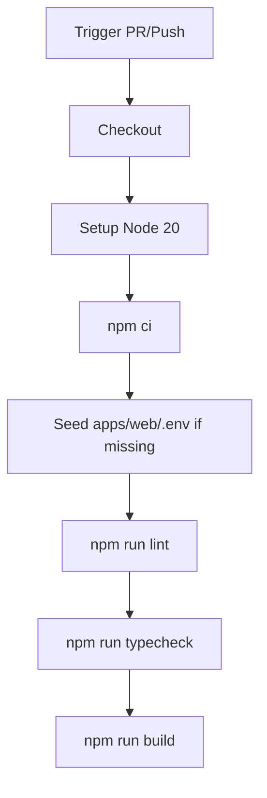
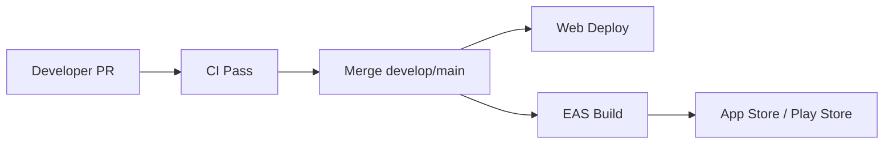

# Sentimeta Monorepo

Monorepo cho hệ sinh thái Sentimeta gồm Web (Next.js) và Mobile (Expo/React Native), dùng chung domain layer qua `@repo/shared`.

## 1. Project Vision

- Phát triển feature song song trên web và mobile.
- Chia sẻ type/schema/hook/store để giảm duplicate logic.
- Giữ app layer mỏng: routing + presentation + platform integration.

## 2. Architecture Overview

### 2.1 High-level system

```mermaid
flowchart LR
  subgraph Clients
    W[Web App - Next.js]
    N[Native App - Expo]
  end

  subgraph SharedMonorepo
    S[@repo/shared\napi hooks schemas store types]
    U[@repo/ui\nshared ui primitives]
  end

  B[(Backend APIs\nSE121-microservices)]
  WS[(WebSocket Gateway)]
  Auth[(Clerk)]
  CDN[(Cloudinary)]
  Push[(Firebase/Push Services)]

  W --> S
  W --> U
  N --> S
  N --> U

  S --> B
  W --> WS
  N --> WS
  W --> Auth
  N --> Auth
  W --> CDN
  N --> CDN
  W --> Push
  N --> Push
```

### 2.2 Monorepo dependency graph


## 3. Repository Map

```text
social-network-2.0/
  apps/
    native/
      app/
        (auth)/
        (main)/          # tabs chính
        (onboarding)/
        (stack)/         # stack screens như post detail
        chat/
      app.json
      app.config.js
      eas.json
    web/
      app/
        (platform)/
          (clerk)/
          (main)/
          admin/
        api/
        marketing/
      docs/
        FCM_SETUP.md
        SERVICE_WORKER_ENV.md
  packages/
    shared/
      src/
        api/
        constants/
        contexts/
        hooks/
        lib/
        schemas/
        store/
        types/
        utils/
    ui/
    typescript-config/
```

## 4. Shared Domain Layer (`@repo/shared`)



Nguyên tắc:
- DTO/schema nằm trong `shared` trước, rồi mới triển khai UI.
- Web và native import cùng contract để tránh drift.

## 5. Feature Data Flow

### 5.1 Feed/Post flow (web/native)



### 5.2 Realtime + push



## 6. Tech Stack

| Layer | Stack |
|---|---|
| Monorepo | npm workspaces, Turbo |
| Web | Next.js 15, React 19, Clerk, React Query |
| Native | Expo SDK 55, React Native 0.83, Expo Router, Clerk |
| Shared | TypeScript, Axios, Zod, Zustand |
| Tooling | TypeScript, ESLint (web), Prettier, GitHub Actions |

## 7. Environment Requirements

- Node.js >= 18 (khuyến nghị Node 20)
- npm >= 10
- Git
- Native development:
  - Expo Go/dev client
  - Android Studio (Android)
  - Xcode (iOS trên macOS)

## 8. Getting Started

### 8.1 Install dependencies

```bash
npm ci
```

### 8.2 Create env files

```bash
cp apps/web/.env.example apps/web/.env
cp apps/native/.env.example apps/native/.env
```

### 8.3 Run apps

```bash
npm run dev --workspace web
npm run dev --workspace sentimeta-native
```

Native platform commands:

```bash
npm run android --workspace sentimeta-native
npm run ios --workspace sentimeta-native
```

## 9. Environment Variables

### 9.1 Web (`apps/web/.env`)

| Group | Variables |
|---|---|
| Clerk | `NEXT_PUBLIC_CLERK_PUBLISHABLE_KEY`, `CLERK_SECRET_KEY`, `CLERK_WEBHOOK_SIGNING_SECRET` |
| Auth route config | `NEXT_PUBLIC_CLERK_SIGN_IN_URL`, `NEXT_PUBLIC_CLERK_SIGN_UP_URL`, `NEXT_PUBLIC_CLERK_SIGN_IN_FALLBACK_REDIRECT_URL`, `NEXT_PUBLIC_CLERK_SIGN_UP_FALLBACK_REDIRECT_URL` |
| Backend | `NEXT_PUBLIC_BACKEND_API_URL`, `NEXT_PUBLIC_WS_URL` |
| Cloudinary | `NEXT_PUBLIC_CLOUDINARY_CLOUD_NAME`, `NEXT_PUBLIC_CLOUDINARY_UPLOAD_PRESET` |
| AI | `OPENAI_API_KEY` |
| Google | `GOOGLE_API_KEY` |
| Firebase push | `NEXT_PUBLIC_FIREBASE_API_KEY`, `NEXT_PUBLIC_FIREBASE_AUTH_DOMAIN`, `NEXT_PUBLIC_FIREBASE_PROJECT_ID`, `NEXT_PUBLIC_FIREBASE_STORAGE_BUCKET`, `NEXT_PUBLIC_FIREBASE_MESSAGING_SENDER_ID`, `NEXT_PUBLIC_FIREBASE_APP_ID`, `NEXT_PUBLIC_FIREBASE_VAPID_KEY` |

### 9.2 Native (`apps/native/.env`)

| Group | Variables |
|---|---|
| Clerk | `EXPO_PUBLIC_CLERK_PUBLISHABLE_KEY` |
| Backend | `EXPO_PUBLIC_API_URL`, `EXPO_PUBLIC_WS_URL` |
| Cloudinary | `EXPO_PUBLIC_CLOUDINARY_CLOUD_NAME`, `EXPO_PUBLIC_CLOUDINARY_UPLOAD_PRESET` |

### 9.3 EAS secret files

- `GOOGLE_SERVICES_JSON`
- `GOOGLE_SERVICE_INFO_PLIST`

## 10. Scripts

### 10.1 Root scripts

| Script | Purpose |
|---|---|
| `npm run dev` | `turbo run dev` |
| `npm run lint` | lint all workspaces that expose lint |
| `npm run typecheck` | typecheck all workspaces |
| `npm run build` | turbo build respecting dependency graph |
| `npm run ci` | lint + typecheck + build |
| `npm run format` | prettier write |

### 10.2 Backend bridge scripts

Các script `se121:*` trong root gọi sang repo backend: `../SE121-microservices`.

## 11. Quality Gate

Run before pushing:

```bash
npm run lint
npm run typecheck
npm run build
```

Per app:

```bash
npm run lint --workspace web
npm run typecheck --workspace web
npm run build --workspace web
npm run typecheck --workspace sentimeta-native
```

## 12. CI Pipeline

Workflow: `.github/workflows/ci.yml`



Notes:
- Lint hiện chạy ở web.
- Native được gate chính qua typecheck/build.

## 13. Release Flow



### 13.1 Web

- Build: `npm run build --workspace web`
- Deploy target: Vercel hoặc hạ tầng Node tương thích Next.js

### 13.2 Native

EAS profiles trong `apps/native/eas.json`:
- `development`
- `development-simulator`
- `preview`
- `production`

Ví dụ:

```bash
cd apps/native
npx eas build --platform android --profile preview
npx eas build --platform ios --profile production
```

## 14. Troubleshooting

### 14.1 `expo-doctor` không chạy từ script

Nếu `expo-doctor` không có trong PATH:

```bash
cd apps/native
npx expo-doctor
```

### 14.2 Expo version mismatch

```bash
cd apps/native
npx expo install --check
```

### 14.3 Env issues

- Xác nhận đã copy `.env.example`.
- Xác nhận `API_URL`/`WS_URL` có thể truy cập từ thiết bị/emulator/browser.

### 14.4 Service Worker env trên web

Xem:
- `apps/web/docs/SERVICE_WORKER_ENV.md`

### 14.5 TS6133 trong native

```bash
npm run typecheck --workspace sentimeta-native
```

Dọn biến không dùng hoặc rename theo convention `_unused`.

## 15. Security Notes

- Không commit secrets thực (`.env` thật).
- Nếu key lộ, rotate ngay ở provider (Clerk/Firebase/OpenAI/Cloudinary).
- Dùng secrets manager cho CI/deploy.

## 16. Additional Docs

- `apps/web/docs/FCM_SETUP.md`
- `apps/web/docs/SERVICE_WORKER_ENV.md`
- `apps/native/README.md`
