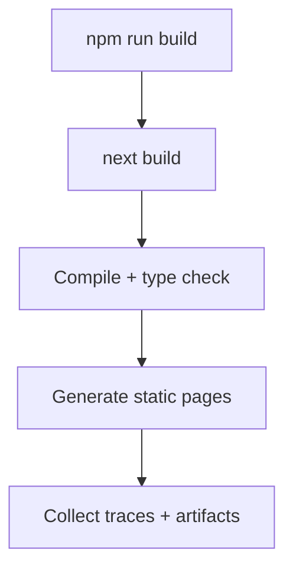

# Web App (`apps/web`)

Ứng dụng web của Sentimeta, xây bằng Next.js App Router.

## 1. Overview

- Runtime: Next.js 15 + React 19
- Auth: Clerk
- Server state: TanStack Query
- Push: Firebase Web Push (tùy cấu hình)

## 2. Architecture

```mermaid
flowchart LR
  UI[App Router pages/layouts] --> Features[Feature components]
  Features --> Shared[@repo/shared hooks/types]
  Shared --> API[Backend API]
  UI --> Clerk[Clerk auth]
  UI --> SW[Service Worker]
  SW --> FCM[Firebase Cloud Messaging]
```

## 3. Folder map

```text
apps/web/
  app/
    (platform)/
      (clerk)/
      (main)/
      admin/
    api/
    marketing/
  docs/
    FCM_SETUP.md
    SERVICE_WORKER_ENV.md
```

## 4. Local development

Từ root repo:

```bash
npm run dev --workspace web
```

Trong thư mục `apps/web`:

```bash
npm run dev
```

## 5. Environment

Tạo file môi trường:

```bash
cp .env.example .env
```

Biến quan trọng:

- Clerk: `NEXT_PUBLIC_CLERK_PUBLISHABLE_KEY`, `CLERK_SECRET_KEY`, `CLERK_WEBHOOK_SIGNING_SECRET`
- Backend: `NEXT_PUBLIC_BACKEND_API_URL`, `NEXT_PUBLIC_WS_URL`
- Cloudinary: `NEXT_PUBLIC_CLOUDINARY_CLOUD_NAME`, `NEXT_PUBLIC_CLOUDINARY_UPLOAD_PRESET`
- OpenAI: `OPENAI_API_KEY`
- Firebase: `NEXT_PUBLIC_FIREBASE_*`

## 6. Quality checks

```bash
npm run lint
npm run typecheck
npm run build
```

## 7. Build flow



## 8. Push notification docs

- `docs/FCM_SETUP.md`
- `docs/SERVICE_WORKER_ENV.md`

## 9. Deploy

- Build output: Next.js production bundle
- Target: Vercel hoặc Node runtime tương thích Next.js 15
